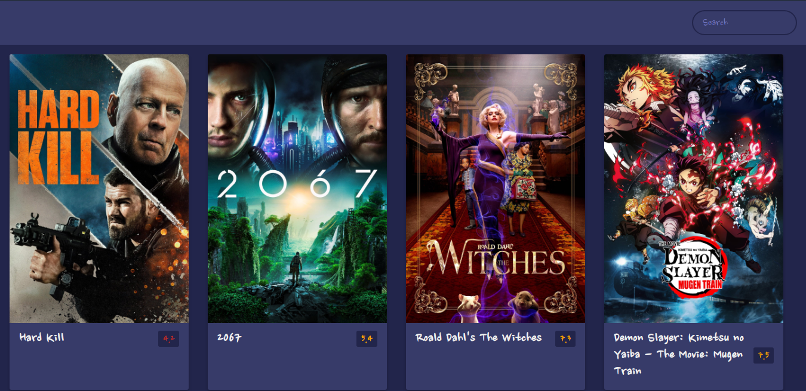

# movie app web
<b>movie app web</b>

# install
<strong>Please Following Commands</strong>

`cd movie-app`

`npm install server --save`

# run application
<strong>Please Following Commands</strong>

`node app.js`

# descriptions

we use a simple api | javascript and html and css used

